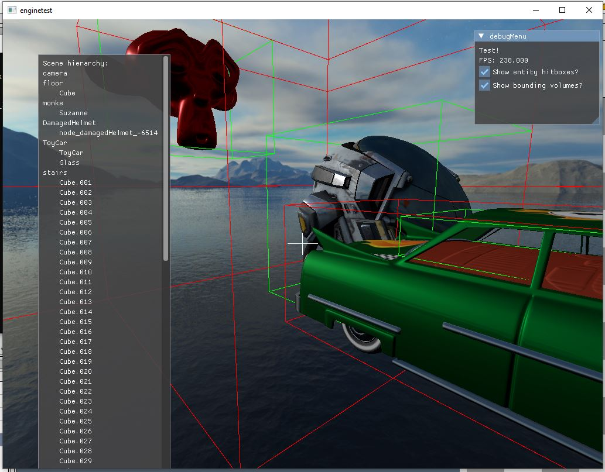

# engine v0.2.0

a random game engine thing. Now finally with ECS!
  

# TO DO LIST

## High priority (tomorrow)

- Support dynamic shadow mapping (at least for shadows cast from the scene's sun)

## Medium priority (next week)

- UI generator exposed at the Application level (Scene UI Systems could use this to draw menus every frame)

- Proper IBL with an irradiance map

- Multiple lights (dynamic and static; do not need to be shadow casting)

- More accurate raycast collision detection (Perhaps only sphere, capsule, OBB colliders. Mesh collision is probably unneccesary.)

## Low priority (next month)

- Explicit post processing pass exposed by the GFXDevice that can be used for bloom, AA, etc

- Audio!!

- Support animations (skinned meshes / morph targets)

- Game controller support (controller detection, input, feedback etc in window.cpp; integration with input_manager.cpp)

# DONE

For mesh rendering, give every mesh-renderer a ShaderMaterial which, depending
on the shader, defines how the mesh reacts to light and also stores a reference
to its texture(s). -- Also make a model loader that works with multiple meshes
(by creating many objects).

The engine needs an event/message system, this will be helpful for collision
detection. Also helpful for general gameplay logic.

The entire vulkan backend needs redesigning without so many classes

Place all instances of a particular component in contiguous memory: I.e., a
scene holds many std::vectors, one for each type of component. These vectors are
looped through every frame. This should optimise things by improving the memory
layout of the program, significantly reducing cache misses.

Implemented glTF file loader

Added a PBR shader with albedo, normal, metallic, roughness, and AO textures

Added the BVH AABB tree made in Summer to start a much better Collision system.

The CameraControllerSystem now uses raycasting to enable FPS-style player movement.

Added static soft shadows.

Sort out LOG_X calls and ensure DEBUG, TRACE, INFO, etc are being used appropriately